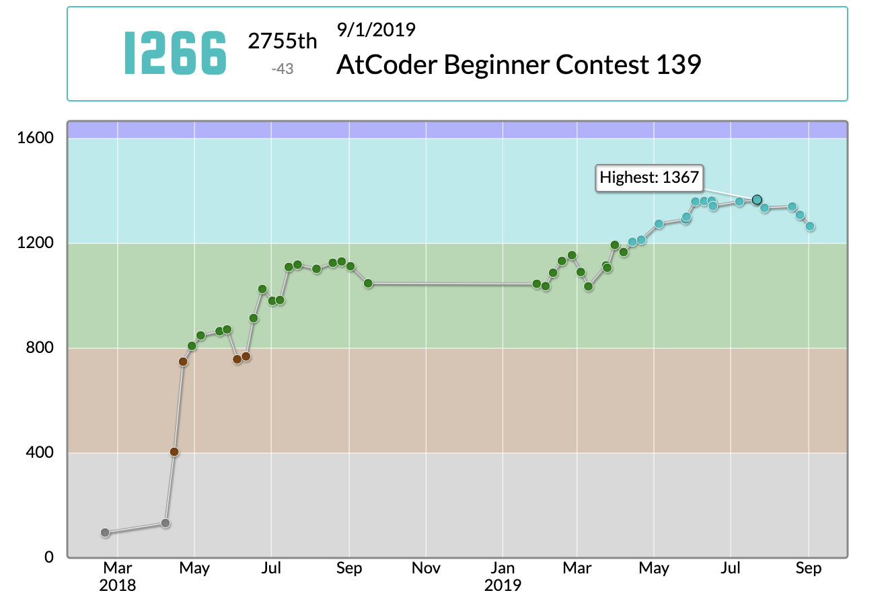

先日（2019/09/01）、AtCoderで開催された[AtCoder Beginner Contest 139](https://atcoder.jp/contests/abc139)に参加しました。

<!--more-->

最近かなり冷えてきてしまいましたが、色々と忙しいので仕方ないかな...
あまり集中できる環境で参加できていません。

大会中に解けたのはD問題までです。
Eは8割くらい解けていました。

解説はEだけでいいかなとも思いましたが、せっかく全問題の引用が自動生成されるので、Aから書いてみようと思います。

---

> ## A - Tenki
> 配点 : 100 点
> Time Limit: 2 sec / Memory Limit: 1024 MB
>
> ### 問題文
>
> ある $3$ 日間の天気予報が、長さ $3$ の文字列 $S$ として与えられます。
>
> $S$ の $i~(1 \leq i \leq 3)$ 文字目が `S` のとき、$i$ 日目の天気予報が晴れだったことを、`C` のときは曇りだったことを、`R` のときは雨だったことを意味します。
>
> また $3$ 日間の実際の天気が、長さ $3$ の文字列 $T$ として与えられます。
>
> $T$ の $i~(1 \leq i \leq 3)$ 文字目が `S` のとき、$i$ 日目の実際の天気が晴れだったことを、`C` のときは曇りだったことを、`R` のときは雨だったことを意味します。
>
> $3$ 日間で天気予報が的中した日が何日あるかを出力してください。
>
> ### 制約
>
> - $S$ および $T$ は長さ $3$ の文字列である。
> - $S$ および $T$ は `S`, `C`, `R` のみからなる。
> <cite> [ABC139 A - Tenki](https://atcoder.jp/contests/abc139/tasks/abc139_a)</cite>

天気の子は、割と早くに見に行きました。

if文を3つ書いて終わりです。

---
> ## B - Power Socket
> 配点 : 200 点
> Time Limit: 2 sec / Memory Limit: 1024 MB
>
> ### 問題文
>
> 高橋くんの家には電源プラグの差込口が $1$ 口しかありません。
>
> そこで、高橋くんは $A$ 個口の電源タップをいくつか使って未使用の差込口を $B$ 口以上に拡張したいと考えています。
>
> $A$ 個口の電源タップ $1$ つと未使用の差込口 $1$ 口を使って、新たに差込口を $A$ 口増やすことができます。
>
> 最小でいくつの電源タップが必要でしょうか。
>
> ### 制約
>
> - 入力は全て整数である。
> - $2 \leq A \leq 20$
> - $1 \leq B \leq 20$
> <cite> [ABC139 B - Power Socket](https://atcoder.jp/contests/abc139/tasks/abc139_b)</cite>

はじめ、電源タップ0この場合を見逃して、少し複雑な場合分けを書いていました。
落ち着いて整理すれば、簡単な式一つで解けます。

---
> ## C - Lower
> 配点 : 300 点
> Time Limit: 2 sec / Memory Limit: 1024 MB
>
> ### 問題文
>
> 左右一列に $N$ 個のマスが並んでいます。
>
> 左から $i$ 番目のマスの高さは $H\_i$ です。
>
> あなたは好きなマスに降り立ち、**右隣の**マスの高さが今居るマスの高さ以下である限り右隣のマスへ移動し続けます。
>
> 最大で何回移動できるでしょうか。
>
> ### 制約
>
> - 入力は全て整数である。
> - $1 \leq N \leq 10^5$
> - $1 \leq H\_i \leq 10^9$
>  <cite> [ABC139 C - Lower](https://atcoder.jp/contests/abc139/tasks/abc139_c)</cite>

一瞬LIS(最長増加部分列)かと思いましたが、もっと簡単でした。

「**右隣の**」と太字になっているのはそういうことだと思います。

これも尺取法に入るのかな？
O(N)で解けます。

---
> ## D - ModSum
> 配点 : 400 点
> Time Limit: 2 sec / Memory Limit: 1024 MB
>
> ### 問題文
>
> 整数 $N$ に対して、$\{1, 2, ..., N\}$ を並べ替えた数列 $\{P\_1, P\_2, ..., P\_N\}$ を選びます。
>
> そして、各 $i=1,2,...,N$ について、$i$ を $P\_i$ で割った余りを $M\_i$ とします。
>
> $M\_1 + M\_2 + \cdots + M\_N$ の最大値を求めてください。
>
> ### 制約
>
> - $N$ は $1 \leq N \leq 10^9$ を満たす整数である。
> > <cite> [ABC139 D - ModSum](https://atcoder.jp/contests/abc139/tasks/abc139_d)</cite>

---
> ## E - League
> 配点 : 500 点
> Time Limit: 2 sec / Memory Limit: 1024 MB
>
> ### 問題文
>
> $N$ 人の選手がテニスの大会に参加します。彼らを選手 $1$、選手 $2$、$\ldots$、選手 $N$ と呼びます。
>
> 大会は総当たり戦で、合計 $N(N-1)/2$ 試合が行われます。
> これらの試合の日程を、以下の条件をすべて満たすように決めることは可能でしょうか。可能である場合、必要な最小の日数も求めてください。
>
> - 各選手は一日に最大で一試合を行う。
> - 各選手 $i$ $(1 \leq i \leq N)$ は、選手 $A\_{i, 1}, A\_{i, 2}, \ldots, A\_{i, N-1}$ とこの順に一度ずつ試合を行う。
>
> ### 制約
>
> - $3 \leq N \leq 1000$
> - $1 \leq A\_{i, j} \leq N$
> - $A\_{i, j} \neq i$
> - $A\_{i, 1}, A\_{i, 2}, \ldots, A\_{i, N-1}$ はすべて異なる。
> > <cite> [ABC139 E - League](https://atcoder.jp/contests/abc139/tasks/abc139_e)</cite>

---
> ## F - Engines
> 配点: 600 点
> Time Limit: 2 sec / Memory Limit: 1024 MB
>
> ### 問題文
>
> E869120 君は最初、$2$ 次元平面上の原点 $(0, 0)$ に立っています。
>
> 彼は $N$ 個のエンジンを持っています。エンジンの使い方と機能は以下のようになります。
>
> - $i$ 個目のエンジンを使うと、E869120 君のいる場所の X 座標が $x\_i$、Y 座標が $y\_i$ 変化する。つまり、E869120 君が座標 $(X, Y)$ にいるときに $i$ 個目のエンジンを使うと、座標 $(X + x\_i, Y + y\_i)$ に移動する。
> - エンジンはどのような順番で使ってもよいが、各エンジンは $1$ 回までしか使えない。ただし、使わないエンジンがあってもよい。
>
> 彼は、原点から最も遠い場所に行きたいです。 
> 最後に到達する地点の座標を $(X, Y)$ として、原点からの距離 $\sqrt{X^2 + Y^2}$ の最大値を求めてください。
>
> ### 制約
>
>
> - $1 \leq N \leq 100$
> - $-1 \ 000 \ 000 \leq x\_i \leq 1 \ 000 \ 000$
> - $-1 \ 000 \ 000 \leq y\_i \leq 1 \ 000 \ 000$
> - 入力はすべて整数
> > <cite> [ABC139 F - Engines](https://atcoder.jp/contests/abc139/tasks/abc139_f)</cite>

---
